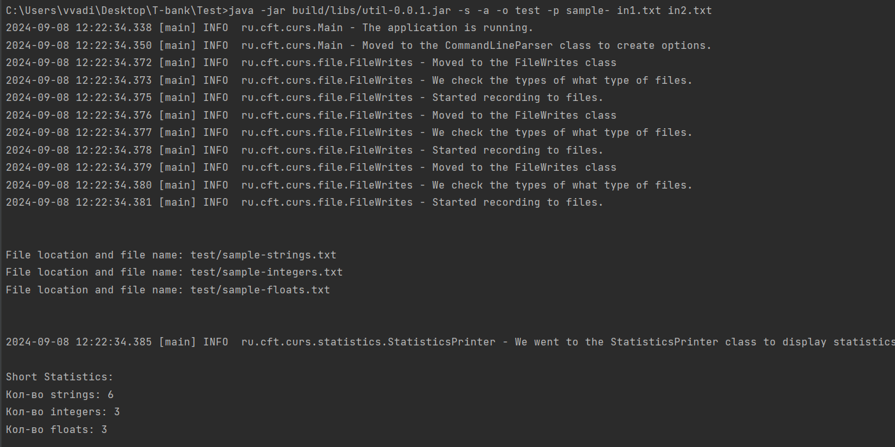
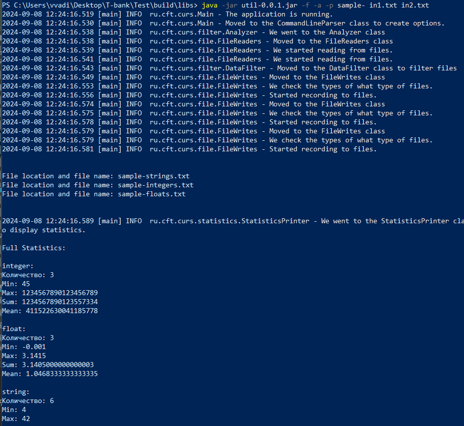

# Утилита фильтрации содержимого файлов

## Описание
Утилита для фильтрации целых чисел, вещественных чисел и строк из файлов. <br>
Программа читает данные из указанных файлов и записывает их в соответствующие выходные файлы с возможностью настройки параметров.

### Ключевые функции:
- Чтение данных из нескольких файлов одновременно.
- Фильтрация элементов по типу: целые числа, вещественные числа и строки.
- Запись отфильтрованных данных в отдельные выходные файлы.
- Возможность настройки имен и путей выходных файлов.
- Сбор и отображение статистики отфильтрованных данных.

## Базовый стэк сборки
- Java: `17.0.6`
- Gradle: `8.2.1`

## Зависимости(библиотеки)
- [Apache Commons CLI](https://mvnrepository.com/artifact/commons-cli/commons-cli) : `1.6.0` —  для работы с командными строками.
- [Log4j](https://mvnrepository.com/artifact/org.apache.logging.log4j/log4j-core) : `2.23.0` —  для логирования сообщений.
- [JUnit](https://mvnrepository.com/artifact/org.junit.jupiter/junit-jupiter-api) : `5.8.1` —  для тестирования кода.


## Как это работает
1. Утилита принимает несколько входных файлов с различными данными.
2. Данные фильтруются по типам и записываются в выходные файлы(базовые названия):
    - `integers.txt` для целых чисел
    - `floats.txt` для вещественных чисел
    - `strings.txt` для строк
   
3. Выходные файлы могут быть настроены через опции `-o` (путь) и `-p` (префикс имен).
4.  При указании опции `-a` задается режим добавления в существующие файлы. По умолчанию файлы результатов перезаписываются.
5. Статистика по фильтруемым данным может быть краткой (`-s`) или полной (`-f`).
    - Краткая: количество записанных элементов.
    - Полная: минимальное, максимальное, сумма и среднее для чисел; длины самой короткой и длинной строки для строк.


## Сборка проекта

1)Клонируйте репозиторий проекта:
   ```bash
   git clone https://github.com/1Valerion1/CFT_Curs.git
   ```

2)Перейдите в директорию проекта 
   ```bash
   cd CFT_Curs
   ```

3)Для сборки проекта выполните следующую команду:
```bash
gradle build
```
После успешной сборки JAR-файл будет находиться по пути `build/libs` с именем файла `util-0.0.1.jar`.


## Запуск утилиты
Чтобы запустить утилиту, используйте следующую команду из корневой папки проекта:
```bash
java -jar util-0.0.1.jar -s -a -p sample- in1.txt in2.txt
```
При желании имя файла можно изменить, обновив строку `archiveBaseName.set('util')` в файле настройки Gradle. Для этого откройте файл `build.gradle`, найдите указанную строку и смените имя.

## Примеры работы
1. Общая информация о запуске утилиты:
```bash
java -jar build/libs/util-0.0.1.jar -s -a -o test -p sample- in1.txt in2.txt
```

2. Фильтрация с полной статистикой:
```bash
java -jar util-0.0.1.jar -f -a -p sample- in1.txt in2.txt
```
